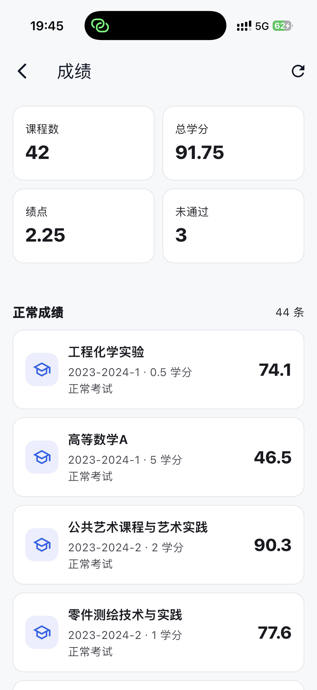

# 新理Lite

新理Lite 是面向新疆理工学院学生的民间校园服务 App，定位为「掌上新理工」的轻量替代方案。项目计划覆盖 Android 和 iOS，使用 Flutter 统一开发。

> 新理Lite 是民间开发版本，不代表新疆理工学院官方应用。

## 截图

| 首页 | 课表 | 校园卡 |
| --- | --- | --- |
|  |  |  |

| 宿舍电费 | 成绩 | 考试安排 |
| --- | --- | --- |
|  |  |  |

## 技术方向

- Framework: Flutter
- Language: Dart
- Platforms: Android, iOS only
- State management: Riverpod
- Routing: go_router
- Network: dio
- Local secure storage: flutter_secure_storage

## 版本

当前版本：`0.1.0+1`

## 构建产物

推送 `v*` tag 后，GitHub Actions 会自动构建：

- Android release APK
- iOS unsigned IPA，用于爱思助手、AltStore、SideStore 等自签工具重新签名安装

手动构建也可以在 GitHub Actions 里运行 `Build Release Artifacts`。

## 文档

- [产品定位](./docs/product.md)
- [Flutter 开发文档](./docs/flutter-development.md)
- [接口接入文档](./docs/api.md)
- [开发路线](./docs/roadmap.md)

## 本机环境

当前工作机已确认：

```text
Flutter 3.41.7
Dart 3.11.5
```

Flutter 工程名为 `xinli_lite`，应用展示名为「新理Lite」。

## License

本项目使用 [GNU Affero General Public License v3.0](./LICENSE) 授权。
